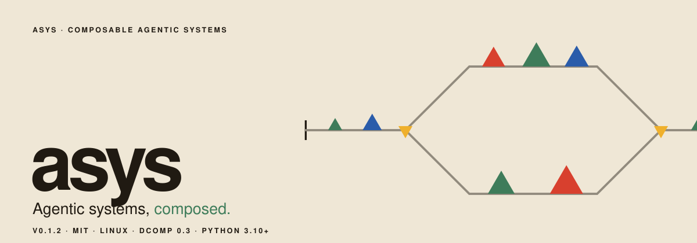
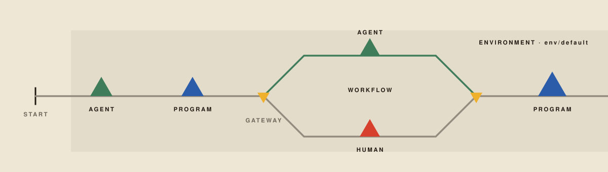

asys runs specialized agents, programs, and human tasks against real project
files. Give one agent an assignment, or coordinate a workflow that creates,
checks, reviews, and revises the work. Runs keep their logs, agent transcripts,
results, and execution state so you can see what happened and why.

The parts are reusable. A worker environment supplies named agents, tools,
skills, and memory. A workflow decides what work to do and in what order. A
separate inference service supplies models. You can use the same environment
across workflows and share inference across environments and users.

[Installation](INSTALL.md) · [Write workflows and environments](asys-bpmn/AUTHORING.md) · [Inspect runs](docs/monitoring.md)

For agents using asys, the portable [asys skill](skills/asys/SKILL.md) covers
team design, environments, BPMN, one-shot, goals, human decisions, and recovery,
with runnable starter projects. Every host installation includes it. `asys skill`
prints its directory; `asys skill DEST` copies it into `DEST/asys` for your agent
or environment. See [skill discovery and installation](INSTALL.md#agent-skill).

## 01 · Follow the work

Consider a workflow for a software change. An agent implements the request in
the project repository. A program runs its tests. A second agent reviews the
change while a person examines the result. The workflow waits for the required
decisions before a final program packages the work.



Conditions and error handlers define when to accept the result, send it back
for repair, or stop. These decisions belong to the workflow. Workers execute
the assignments they receive, using the tools installed in their environment.
Agent jobs use the Pi coding-agent SDK to call models and tools over multiple
steps; program jobs execute commands; human jobs wait for a submitted answer.

You can follow stage progress, read the actual agent conversation, and inspect
program output while a run is active or after its components have stopped:

```sh
asys top
asys status latest
asys logs latest
```

For a failed BPMN run, `asys-bpmn resume RUN` restores its saved workflow state
and restarts the failed stage and affected unfinished work as new jobs.
Completed work and project files remain available. See the
[resume requirements](asys-bpmn/README.md#resume-a-failed-workflow).

## 02 · Compose the parts

| Part | What it defines |
| --- | --- |
| Workflow | Assignments, dependencies, branches, parallel work, human decisions, and error handling. |
| Worker environment | Named agents and their models, memory, skills, extensions, and installed programs, packaged in a Docker image. |
| Inference service | Providers and poolers composed behind the named `@inference_endpoint` interface. |
| Project workspace | The actual repository or directory where jobs read and modify files. |
| Run state | Job requests, logs, transcripts, reports, proposed lessons, results, and workflow checkpoints. |

A workflow and its environments are ordinary project files. Keep one workflow
with several environments, or many workflows and environments in one
repository. The launcher takes paths; it imposes no repository layout. Before
execution, the BPMN runner checks that the selected environment declares the
job types the workflow needs.

Environment agents read their memory and skills from the environment. Core asys
supplies system agents separately; one-shot and goal use its `simple` agent with the
environment's shared resources. Agents write
reports and proposed lessons into their job directories. Updating retained memory is
an explicit change to the environment, which several runs can reuse. Project
deliverables stay in the workspace, separate from execution records.

[dcomp](https://github.com/glguida/dcomp) manages the containers and typed
component interfaces. Inference and human services communicate through those
interfaces. Workflow managers submit work through the runtime's shared
filesystem job protocol, with a job directory and workspace prepared for each
assignment.

BPMN is one orchestration engine in this system. `asys-oneshot` uses the same
worker execution libraries for a single assignment, and `asys` reads saved
runs independently of the engine. Other orchestration programs can reuse the
runtime and workers. The BPMN engine accepts BPMN 2.0 XML with a small asys
execution binding; see its [format and scope](asys-bpmn/README.md#bpmn-binding).

## 03 · Install and run

Use Linux with a local Docker Engine. Install dcomp separately, then install
asys from this repository root. The [installation guide](INSTALL.md) lists
build dependencies and the dcomp installation procedure.

```sh
export PATH="$HOME/.local/bin:$PATH"
make install
```

This installs the host commands under `$HOME/.local` and builds the component
images. `PREFIX` selects another installation destination. State is private to
the invoking user by default; the shared-machine setup follows below.

### Try a complete workflow

The bundled [shared workspace example](asys-bpmn/examples/shared-workspace)
prepares a project, writes two report sections in parallel, then assembles them
after both finish. It uses ordinary programs and needs no model account.
From this repository root, after installation:

```sh
mkdir -p ./report-workspace
asys-bpmn run \
  asys-bpmn/examples/shared-workspace/workflow.bpmn \
  asys-bpmn/examples/shared-workspace/env/dummy \
  --input asys-bpmn/examples/shared-workspace/request.md \
  --workspace ./report-workspace

cat ./report-workspace/project/report.txt
asys logs latest
```

The report contains “First section” and “Second section”. The launcher prints
the run ID and saved-state directory, and removes the run's components when
execution finishes. The project files and run records remain.

### Add inference and run agents

Initialize an inference server once, start it, and authenticate a provider.
For example, with the OpenAI Codex provider:

```sh
asys-inference init
asys-inference start
asys-inference gateway login openai-codex --as work
asys-inference models
```

The server exports `@inference_endpoint` and continues running after the
command exits. Use [asys-inference](asys-inference/README.md) to add providers
and poolers or change the pipeline while it is running.

Create a worker environment from the [default template](asys-workers/env/default)
or the [minimal environment example](asys-oneshot/README.md#environment).
One-shot uses the `simple` system agent supplied by asys. Set that agent's
default inference model using a name returned by `asys-inference models`, then
run an assignment:

```sh
asys system-model set simple account/model
asys system-model list
asys-oneshot ./env/review \
  "Review the current changes and run the relevant checks" \
  --workspace ./project
```

The default is saved in the selected asys state's `config.json` and applies
across environments. Pass `--model MODEL` to override it for one invocation.
Without either setting, one-shot prints instructions for configuring the model.

The [simple agent's prompt](python/asys/system_agents/simple/prompt.md) and
worker setup belong to the shared asys system-agent package. Other launchers
can use that agent independently of one-shot.

To implement a goal and verify it in a fresh session, use the
[goal launcher](asys-goal/README.md):

```sh
asys-goal ./env/development "Implement the requested behavior and its tests" \
  --workspace ./project
```

It repeats implementation and verification until the goal is verified, with
no default attempt limit. Either phase can ask for human help through
`asys-human-prompt`. The loop lives in the workers program, so BPMN can use it
as an ordinary `goal` job too. It uses the configured `simple` model;
`--model MODEL` overrides it for a run.

A workflow takes the same kind of environment and a Markdown request file:

```sh
asys-bpmn run ./workflow.bpmn ./env/review \
  --input ./request.md --workspace ./project
```

The environment directory defines what can execute. The workspace is the
existing project directory those jobs will edit; it defaults to the current
directory. Each job receives separate storage for its transcript, logs, report,
and scratch work. On each start or resume, the launcher rebuilds an environment
that has a Dockerfile, using the current base images and Docker's cache.

For workflows with human tasks, run the handler in another terminal using the
same host state:

```sh
asys-human-prompt --system asys
```

Workflows automatically start the shared service at `@human_endpoint`. The
terminal can attach later, and pending jobs keep waiting when it disconnects. Add `--human`
to `asys-bpmn run` or `resume` to answer only that run's requests in its terminal. See the [human handler guide](asys-human-interface/README.md).

After installing a new version, run `asys update` to refresh shared services in
the current asys state. Running workflow and worker containers stay in place.
See [updating an installation](INSTALL.md#update-an-existing-installation) for details.

## 04 · Share a machine

Install the tools globally so users can share one setup. Everyone needs access
to the same local Docker Engine and `/usr/local/bin` on their `PATH`.
From an updated dcomp source checkout, then from the asys source checkout:

```sh
# In the dcomp checkout
make build
sudo make install PREFIX=/usr/local

# In the asys checkout
sudo make install PREFIX=/usr/local
```

Create a Unix group and add the participating users. Replace `alice` and `bob`
with their login names:

```sh
sudo groupadd --force asys
sudo usermod -aG asys alice
sudo usermod -aG asys bob
sudo install -d -g asys -m 2770 /srv/asys
```

Log in again for the new group membership to apply. Then, as a group member,
initialize the shared state:

```sh
asys init /srv/asys/host --dcomp /srv/asys/dcomp --group asys
source /srv/asys/host/asys-env
```

This creates asys state in `/srv/asys/host`, dcomp state in `/srv/asys/dcomp`,
and the file `/srv/asys/host/asys-env`. Repeating initialization preserves existing
state. The generated file sets `ASYS_STATE_ROOT` and `DCOMP_STATE_ROOT`;
sourcing it selects this setup and adds `{ host }` to the existing shell
prompt. The label comes from the asys state directory's final name. Sourcing
another setup replaces the label; repeated sourcing does not accumulate it.

Start and authenticate inference once under this shared setup, using the
commands above. Each user then sources the same generated file and runs work
from a project directory:

```sh
source /srv/asys/host/asys-env
cd /path/to/project
asys-inference models
asys-oneshot /path/to/environment "Complete the assignment" --model account/model
asys top
```

`--model` overrides the configured model for the `simple` system agent. `asys-env`
selects host state; the worker environment supplies tools and shared resources.
Project workspaces and environment sources must be accessible to the users
who run them. Group members share access to run records, inference
configuration, credentials, and control of the dcomp setup.

For private or custom setups, see [state directories](INSTALL.md#select-state-directories).
The full command is `asys init DIR [--dcomp DIR] [--group GROUP]`; it creates
`DIR/asys-env` and prints the command to source it.

## 05 · Packages and guides

| Package | Responsibility |
| --- | --- |
| [asys](docs/monitoring.md) | Supply system agents; initialize host state; configure models; inspect runs, logs, results, and agent transcripts. |
| [asys-oneshot](asys-oneshot/README.md) | Run an assignment with the shared simple agent against a project workspace. |
| [asys-bpmn](asys-bpmn/README.md) | Execute BPMN workflows, handle control flow, and resume failed runs. |
| [asys-workers](asys-workers/README.md) | Define worker environments, agent memory, skills, tools, and execution behavior. |
| [asys-runtime](asys-runtime/README.md) | Execute filesystem jobs, supervise processes, and record their outcomes. |
| [asys-inference](asys-inference/README.md) | Build and manage the providers behind `@inference_endpoint`. |
| [asys-human-interface](asys-human-interface/README.md) | Receive human requests at @human_endpoint and present them in a terminal. |

The [workflow and environment authoring guide](asys-bpmn/AUTHORING.md) covers
project layout, job types, prompts, workspaces, branching, parallelism, human
decisions, and recovery. The [release notes](CHANGELOG.md) describe the changes in each version.

The [visual style guide](docs/styleguide.pdf) defines the graphic language;
[SVG assets](docs/assets) provide its marks, rails, and section graphics.


