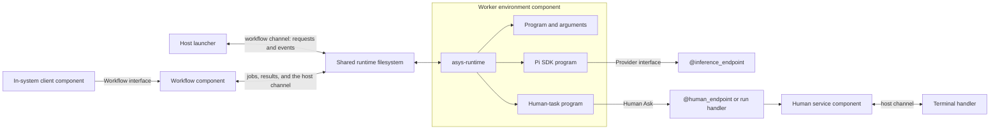

# asys-bpmn

A reusable dcomp component that loads BPMN XML and runs it in a selected worker
environment. The workflow contains tasks, prompts, commands, questions, and
control flow. [Worker environments](../asys-workers) contain Dockerfiles, runner
configuration, installed tools, and skills. [asys-runtime](../asys-runtime)
executes their jobs independently of BPMN.

The [authoring guide](AUTHORING.md) covers projects, environments, prompts,
programs, human decisions, workspace handling, parallel work, and recovery.
The [shared-workspace example](examples/shared-workspace) is a runnable workflow with its own
environment that passes real files through a split and join.

## Workspace and jobs

All jobs work in the actual project directory selected by `--workspace DIRECTORY`
(default: the current directory). The launcher mounts it through dcomp. BPMN
controls when jobs run; their task descriptions determine the files they read
and modify. Parallel tasks share that workspace, so assign separate files or
serialize changes to shared files.

Each execution gets a fresh job ID and directory for logs, transcripts, scratch,
reports, lessons, and its JSON result. `asys status --json` shows each job's
directory and actual workspace.

## Run a workflow

The host command takes two paths:

```text
asys-bpmn run WORKFLOW.bpmn ENVIRONMENT_DIRECTORY [OPTIONS]
```

The [hello example](examples/hello/README.md) contains a workflow and its own
environment together:

```text
examples/hello/
  workflow.bpmn
  env/dummy/
    workers.json
    Dockerfile
    component.dcomp
    programs/agent
```

Build from the repository root, then run it:

```sh
make -C asys-bpmn build
asys-bpmn/bin/asys-bpmn run \
  asys-bpmn/examples/hello/workflow.bpmn \
  asys-bpmn/examples/hello/env/dummy
```

The launcher handles Docker and dcomp startup and cleanup. No manual dcomp
commands are needed to run this example.

This needs Python 3.10+, Docker, and dcomp 0.3.1+ (Machine API 2) on the host.
Dcomp and `dcomp-proxy` are separate installations. `DCOMP_BINARY` and
`DCOMP_PROXY_BINARY` can select their executable paths. `make -C asys-bpmn install`
installs the launcher into `$HOME/.local/bin` and its Python package under
`$HOME/.local/share/asys-bpmn/python`; `PREFIX` and `DESTDIR` override that
destination. No host Python package installation is needed. Node and the
execution dependencies run in the images.

Both arguments may be relative or absolute paths, including paths containing
spaces. The environment directory supplies `workers.json`, `component.dcomp`,
and optionally a Dockerfile, programs, and skills. No repository layout or
project manifest is required. On every run and resume, the launcher builds that
directory when it has a Dockerfile, using the current installed base images and
Docker's build cache. Otherwise, it resolves the image declared in
`component.dcomp` again; that image must exist locally. The resulting image ID
is fixed for the current invocation. The shared workflow image, `asys-bpmn:dev`,
is built by `make build`. Set `ASYS_BPMN_IMAGE` to select a different image.

The command starts a worker environment and a workflow component, loads the XML,
and starts one run in that environment. It waits in the foreground, prints
progress to stderr, and writes the final workflow output as JSON to stdout.
Success exits 0, failures exit 1, and Ctrl-C cancels the run and exits 130.
Components started by this invocation are removed on exit. Other components in
the dcomp system, including inference providers and other workflow runs, remain
independent. Forced process death cannot run cleanup; the saved run record lists
the components it owns.

Pass a Markdown file containing the request:

```sh
asys-bpmn run ./workflow/workflow.bpmn ./workflow/env/yosys \
  --input ./request.md
```

The file's UTF-8 text becomes the workflow variable `request`, with its Markdown
formatting preserved. A task can use `input="= {prompt: request}"` or combine
`request` with its own instructions. `--input -` reads the request text from
stdin. Workflows that need no request can omit `--input`.

Create `agents/general/` with optional `memory.md` in the environment.
Choose the agent runner and model in the environment's `workers.json`, for
example:

```json
"agent": {
  "command": ["/opt/asys/asys-workers/tools/asys-agent", "--agent", "general", "--model", "account/model",
              "--extension", "/opt/asys/asys-workers/extensions/bpmn.mjs"]
}
```

This entry belongs under `types`. Use a model name exported by
`asys-inference models`. The workflow supplies prompts; changing this worker
entry selects another model for its agent tasks. Different job types can select
different runners or models in the same environment.

`--process ID` selects an executable
process when the document has several. Options work before or after either
path. The run's environment name comes from the selected `workers.json`, not
the directory's basename.

Components are named `<name>-workflow-<id>` and `<name>-workers-<id>`. The name
comes from the BPMN definitions' `name`, then `id`, then the filename; `--name
NAME` overrides it. Names are converted to lowercase words separated by hyphens
and use the first 16 characters of the run ID. For example, `PcbEngineer`
produces `pcb-engineer-workflow-…` and `pcb-engineer-workers-…`.

The default dcomp system is `asys`; `--system NAME` selects another. An environment
input named `inference` with the unchanged Provider type is wired to
`@inference_endpoint`. Start an inference provider in that system before using
such an environment. `-L INPUT=TARGET` / `--link INPUT=TARGET` selects another
component output or global name; repeat it for additional inputs. A target of
`-` explicitly leaves an input unconnected. These are initial run connections.

For outbound internet access, set `"egress": true` at the top level of the
environment's `workers.json`. It defaults to false and applies to the worker
container. The workflow component needs no network, and no ports are published.
The dcomp Provider connection works without egress.

Run records, workflow checkpoints, job records, command and component logs, and events live
under `$XDG_STATE_HOME/asys/runs/<run-id>` or
`$HOME/.local/state/asys/runs/<run-id>`. `--root DIRECTORY` or
`ASYS_STATE_ROOT` selects the asys base; runs go in its `runs/` directory.
`--root DIRECTORY` selects the runs directory directly. The selected workspace is edited in place. Job state is kept separately. `--dcomp-state-root DIRECTORY` and
`--runtime-root DIRECTORY` select nondefault dcomp state and proxy roots.

The host command talks to the workflow component over a runtime channel in the
run's shared runtime root, `runtime/channels/workflow`: it publishes a `start`
request on `in` and follows run events and the final `run.result` on `out`. No
port is published and no token exists; the run directory's permissions are the
authorization. The channel path is printed and saved in `run.json`, so another
host process can send `cancel` or `message` requests, or follow the same events,
while the command waits. Internal dcomp sockets remain component endpoints.
Workers send human requests through their `human` input, connected by default
to `@human_endpoint`. Start [`asys-human-prompt`](../asys-human-interface/README.md)
in another terminal to publish this shared service. Alternatively, add `--human`
to `run` or `resume`: the launcher creates a terminal handler for this run and
links its workers directly to it, leaving the shared global untouched. The
handler closes with the run. While it owns the terminal, read workflow progress
with `asys logs RUN` or `asys top`.

The shared channel directories and their files allow different host and
container user IDs; the enclosing run directory stays private to the host
user. The workflow component checks the selected environment's definition
when handling `start`, using the definition hash supplied by the launcher.



The workflow component owns its BPMN definitions, run checkpoints, and event log
in SQLite. The job queue and program workspaces are separate. A workflow process
can restart while executors keep working, then reattach to the same jobs.

## Resume a failed workflow

```sh
asys-bpmn resume RUN
```

`RUN` is a run ID, unique prefix, or saved state directory. Use `--root DIRECTORY`
when the run was created under another state root. The command restores the
stored BPMN execution, variables and job identities. Completed jobs stay complete;
the failed stage and unfinished work cancelled by its failure get new job IDs
and directories, using the original requests and the same actual workspace.
The journal records each new job and the failed or cancelled job it replaces. An agent stage starts again
with its original prompt and a fresh session.

The original XML is stored in `workflow/workflow.sqlite` inside the run directory;
the original BPMN file is not needed. Resume refreshes both the environment and
the installed `asys-bpmn:dev` engine image (or `ASYS_BPMN_IMAGE`) automatically.
It rebuilds the original environment directory when it has a Dockerfile, or
resolves its current declared image otherwise. Docker's cache reuses unchanged
layers and rebuilds layers affected by an updated base image.

The original environment directory and workspace must remain available. The
environment must keep its name and declare the job types required by the workflow.
Updated commands, models, and tools are used by newly submitted jobs. Completed
and explicitly cancelled runs cannot be resumed.

Installing updates leaves running containers alone; the new images take effect
at the next start or resume.

Resume uses the failure checkpoint saved before an unhandled job error, or
the last execution checkpoint if a component stopped before the error was
recorded. It creates fresh jobs for unfinished stages before execution resumes.
Explicit cancellation is separate and cannot be resumed. Engine versions must
match the saved state.

Recovery belongs to the BPMN runner. Use `asys status`, `asys logs` and `asys top`
to observe the same run ID while it continues.

## Observe a workflow

`asys-bpmn run` prints stage starts, finishes, waits, and failures
using the BPMN's names and IDs. Finished stages include elapsed time, and repeated
executions are numbered. Program failures include their saved error output.
Provider exhaustion, retry time, and compaction remain visible. These readable
messages are also saved in the run's `run.log`.

Use the separate `asys` command for observation:

```sh
asys ps                         # saved runs
asys status latest              # one run, its jobs and results
asys logs latest                # saved workflow output
asys logs latest -f              # follow new output
asys logs latest design_module  # one job name's stdout and stderr
asys top                        # runs, jobs, and agent transcripts
```

A saved workflow log includes messages such as:

```text
2026-09-14T10:00:01Z  STARTED   Plan architecture (architecture)
2026-09-14T10:00:11Z  FINISHED  Plan architecture (architecture) — 10s
2026-09-14T10:00:30Z  WAITING   Approve design (approval) — waiting for message
```

The observer displays these messages as text and reads ordinary run and job
state. BPMN interpretation stays in the workflow software. See the
[asys monitoring guide](../docs/monitoring.md) for selectors, transcript controls,
custom state locations, archived runs, and log sources.

## Environment selection and compatibility

Each `StartRun` request includes an `environment` name. All jobs issued by that
run, including called processes and ad-hoc actions, use that environment. The
name is saved with the run and retained after restart. The same loaded BPMN can
run in different environments concurrently.

`ListEnvironments` returns names, descriptions, and declared job types.
`CheckWorkflow` compares the job types used by a selected BPMN process with an
environment's declarations. It includes nested and called processes; a dynamic
process call conservatively requires the types of every possible process in the
document. Unrelated processes are otherwise excluded.

`StartRun` performs this check before creating a run or submitting jobs. Missing
types are reported by name. Compatibility checks do not start programs, evaluate
toolchains, contact models, prove prompt quality, or validate task outcomes.
Expressions and each program's input contract are checked when applicable during
execution. A compatible environment can still fail to execute a task.

Environment descriptors are derived from `workers.json` and retained when a
worker stops. They describe declarations, not availability. A run pins the
environment name, not an immutable container image; replacing that environment's
implementation affects future jobs in it.

## BPMN binding

Use BPMN 2.0 XML with one execution binding inside `extensionElements`:

```xml
<bpmn:serviceTask id="research" name="Research the question">
  <bpmn:extensionElements>
    <asys:job type="agent"
      input="= {prompt: request}"
      args="= []"
      result="report"/>
  </bpmn:extensionElements>
</bpmn:serviceTask>
```

Declare `xmlns:asys="urn:asys:workflow:1"` on the definitions. The binding's
[XML schema](asys.xsd) and [bpmn-moddle descriptor](src/moddle.json) can be used by
external editors. BPMN diagram geometry and the original XML are preserved.
You load the XML directly; each workflow does not need a separate executable or
Docker image.

All supplied examples include BPMN Diagram Interchange (DI): shapes and connector
coordinates alongside the process in the same `.bpmn` file. They can be opened
in [bpmn.io](https://demo.bpmn.io/). Editing their layout and task labels in the
ordinary modeler preserves the existing `asys:job` bindings.

| Attribute | Meaning | Default |
| --- | --- | --- |
| `type` | Runtime job type, chosen by your configuration | Required |
| `input` | FEEL expression producing JSON input | `= variables` |
| `args` | FEEL expression producing a list of argument strings | `= []` |
| `result` | Variable receiving the job result | Activity ID |

A type identifies a program, independently of the task's BPMN name or kind.
For example a `userTask` can bind to an approval program, a `serviceTask` to an
agent, and a `scriptTask` to Python. The runtime appends evaluated arguments to
the configured program's argument array. It does not interpret a shell command.

Expressions use FEEL. Workflow variables are available directly and under
`variables`; the context also includes `output`, `message`, `inputs`, `item`,
`index`, `task`, and loop counters. Data input/output associations support direct
copies and FEEL transformations, including multiple sources. Multi-instance
collections use the standard `loopDataInputRef` and `inputDataItem` fields.
Variables named `task` or `inputs` remain accessible under `variables`.

For ad-hoc actions, the coordinator receives the `message` paths referenced by
each action's job bindings. The `start_action` input becomes `message` unchanged;
for example, a binding that reads `message.part` consumes a `part` field in that
input. Before starting a directly bound task, the runtime checks the proposed
input for expression type errors and invalid argument lists. A rejected call
returns an error to the coordinator, which can correct its input and try again
without starting or failing the child activity. Optional fields and ordinary
FEEL null semantics are preserved. Loop bindings are evaluated when their
instance data is available during execution.
`task` contains the parsed BPMN activity, so the default
`program` type can run a script task using `args='= ["python3", "-c", task.script]'`. A nonzero
program exit becomes a BPMN activity error; its exit code is the error code.

Executable processes require `isExecutable="true"`. Executing tasks require an
explicit job binding; an unbound receive task waits for a message. Called
processes must be present in the same document. Unrelated nonexecutable diagrams
can remain unbound.

## Ad-hoc work

An `adHocSubProcess` uses its own job binding for the program that selects work.
The producer advertises its inner activities as filesystem actions. Pi agents
whose environment selects the bundled `bpmn.mjs` extension
expose these through `list_actions`, `start_action`, and `wait_action`; another
program can use the same request/result files directly.

Activities without incoming flows begin enabled. Completing an activity
propagates its sequence flows and enables dependent activities for selection.
The coordinator selects each activity explicitly. An activity can be selected
again after it finishes. Sequential ordering permits one active selection at a
time; parallel ordering permits different activities to run together. Concurrent
instances of the same inner activity are currently rejected as busy.

The BPMN completion condition is checked when an inner activity completes.
`cancelRemainingInstances` controls cancellation or waiting for active work in
parallel scopes. Without a completion condition, the coordinator finishing
requests completion. The subprocess result contains inner activity outputs and
the coordinator's result under `result`.

[agent-review.bpmn](examples/agent-review.bpmn) demonstrates an agent selecting a
drafting agent and then a human review. The runtime receives ordinary job assignments throughout.

## Component and storage

The launcher configures these components and mounts automatically. This section
describes their interfaces and storage for applications embedding the runtime.

The component exports `asys.workflow.v1.Workflow` as `workflow`. It takes
`--state DIRECTORY` (default `/var/lib/asys-bpmn`) and `--root DIRECTORY`
(default `/var/lib/asys/runtime`). The launcher mounts the run's `runtime/`,
`jobs/`, and the selected actual workspace at `/var/lib/asys/runtime`,
`/var/lib/asys/jobs`, and `/var/lib/asys/workspace` in both components. The host
run directory keeps a `workspace` symlink to the selected project, matching
the relative reference used in job requests. Mounts stay fixed as jobs arrive. Preserve this relative directory layout
when embedding the components. Each environment has its own queue below
that root; source definitions remain in their environment images. Each workflow
component needs its own state directory.
Directories must be writable by the invoking host user; the launcher runs
workers and BPMN with that user's UID/GID.

`--host-channel NAME` serves the host over the runtime channel `NAME` below
the runtime root. Requests on `in` are `start` (`id`, `bpmnXml`, `processId`,
`environment`, `variables`), `resume` (`id`), `cancel` (`id`), and `message` (`runId`, `target`,
`id`, `payload`); each is answered on `out` by `accepted` or `rejected` carrying
the request's sequence number. Every committed run event is published on `out`
with its `runId`, `activityId`, `time`, `data`, and the store sequence it came
from, followed by `run.result` after each terminal event. The channel is
optional; the ordinary dcomp output keeps its existing component contract. The
host launcher enables the channel automatically.

`start` also accepts `environmentDefinition`, the expected `workers.json`
definition hash. A mismatch rejects the request before starting work.
The publisher recovers from the last run event or result, independently of
request acknowledgements. Publication errors stop the component and become
visible to the launcher through its component health checks.

Stopping the worker container interrupts its active programs. Interrupted jobs
remain terminal when workers return; the caller can submit new jobs against the
same project workspace. Stopping the workflow
component preserves its runs and does not cancel jobs. `CancelRun` explicitly
cancels the run's outstanding jobs.

## Workflow interface

The [contract](proto/asys/workflow/v1/workflow.proto) provides:

- `LoadWorkflow`, `ListWorkflows`, and `Describe` for definitions and original XML.
- `ListEnvironments` for registered names and declared job types.
- `CheckWorkflow` for structural compatibility with a selected environment.
- `StartRun`, `ResumeRun`, `GetRun`, `ListRuns`, and `CancelRun` for executions.
- `SendMessage` for BPMN messages, signals, and waiting receive executions.
- `GetEvents` for a durable, sequenced event log.

Definitions are identified by content. Each run keeps its original definition.
Run and message IDs are chosen by the caller and act as idempotency keys.
Different input or a different environment under an existing run ID is rejected.

The following code runs in a client component with a
`asys.workflow.v1.Workflow` input named `workflow`, wired to the workflow
component's output. Workers consume the selected Human service through their `human` input.

```js
import { readFile } from 'node:fs/promises';
import { workflowClient } from './src/client.mjs';

const workflow = workflowClient('workflow'); // DCOMP_IN_WORKFLOW supplied by dcomp
const { workflowId } = await workflow.loadWorkflow({
  bpmnXml: await readFile('agent-task.bpmn', 'utf8'),
});
const { environments } = await workflow.listEnvironments({});
console.log(environments.map(environment => environment.name));
const check = await workflow.checkWorkflow({ workflowId, environment: 'default' });
if (!check.compatible) throw new Error(`Missing types: ${check.missingTypes.join(', ')}`);
await workflow.startRun({
  id: 'task-42', workflowId, environment: 'default',
  variablesJson: JSON.stringify({
    request: await readFile('request.md', 'utf8'),
  }),
});
// The same workflow uses the dummy implementation for this independent run.
await workflow.startRun({
  id: 'task-dummy', workflowId, environment: 'dummy',
  variablesJson: JSON.stringify({ request: await readFile('request.md', 'utf8') }),
});
```

Human decisions use the separate [Human interface](../asys-workers/README.md),
which works for human jobs issued by any producer.

## Verification

```sh
npm ci
npm test
npm run test:diagrams
DCOMP_BINARY=/path/to/dcomp tools/integration-test
```

The diagram test requires Google Chrome, or a Chromium executable selected by
`BPMN_BROWSER`. It opens every example in bpmn.io's unmodified modeler, edits
the layout and a task label, and checks that the exported XML still renders
and retains its execution bindings and script bodies.

The integration test requires dcomp 0.3.1+ and the built images. It creates an
isolated system with a mock Provider and a client component. The host uses a
filesystem channel; the client owns its dcomp inputs. The test runs identical
BPMN in two environments, edits real workspace files through a split and join, exercises actual Pi
SDK tools, pushed human-attention notifications and decisions, and restarts
components while work is pending. Reconnecting the notification stream reports
the unanswered request again.
It also runs the host launcher against paths with spaces, checks failures and
Ctrl-C cancellation, and verifies that cleanup preserves existing components.
It removes its test system afterward and makes no paid inference calls.

The parser and execution binding are based on
[BPMN 2.0.2](https://www.omg.org/spec/BPMN/2.0.2/PDF). They are not a claim of full
BPMN execution conformance. Execution uses the pinned `bpmn-elements` engine and
FEEL expressions. Unsupported execution bindings are rejected when loading;
parsing and preserving an element does not by itself implement its execution.
Data-association assignment blocks and multi-instance event behaviors other
than `All` are currently rejected. External BPMN imports must be resolved into
the loaded document. Concurrent ad-hoc instances of the same inner activity
remain an execution limitation.
