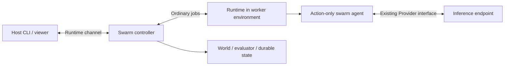

# asys-swarm

Run a population of agents inside a user-defined world. Each agent receives a
mission, an optional objective, its permitted observation and private memory.
It proposes bounded actions; the world applies their consequences and checks
whether the objective was achieved. The controller schedules ordinary runtime
jobs and communicates with the host through a runtime channel.

**A swarm can have a goal.** `mission` is the prompt explaining what to attempt.
`objective` supplies parameters to a Python evaluator that decides success from
the actual state. Omitting `objective` creates an exploratory run, still bounded
by turns, decisions and wall time. A persuasive answer from an agent never
counts as proof of completion. See [programming a goal](AUTHORING.md).

## Run the terrarium

After the repository's [installation prerequisites](../INSTALL.md), build and
install the feature:

```sh
make -C asys-swarm install
mkdir -p /tmp/terrarium-work
asys-swarm run ./asys-swarm/examples/terrarium/swarm.json \
  ./asys-swarm/examples/terrarium/env/scripted \
  --workspace /tmp/terrarium-work --view
```

Run these commands from the repository root. Installed copies of the examples
also live under `PREFIX/share/asys-swarm/examples/`. Use their paths when running
outside the checkout. The launcher prints the run ID, saved state directory,
workspace and local viewer address. `--view` keeps the viewer open after the run
ends; Ctrl-C then closes it without changing the completed result.

The [Rainkeepers terrarium](examples/terrarium/README.md) is an ordinary directory
containing `swarm.json`, `world.py`, `view.html` and two worker environments. Eight
inhabitants build rain collectors, gardens and channels. After 24 construction
turns, the world removes every agent and stops the rain for 12 turns. The goal
is for at least six gardens to remain healthy through that drought. The viewer
shows the habitat, measurements, recorded interactions and constructions that
continue functioning after their builders leave.

The scripted environment is a deterministic installation check. For model
decisions, authenticate and start [asys-inference](../asys-inference/README.md),
select an exported model, then change the environment path:

```sh
asys-inference models
asys system-model set simple account/model
asys-swarm run ./asys-swarm/examples/terrarium/swarm.json \
  ./asys-swarm/examples/terrarium/env/agents \
  --workspace /tmp/terrarium-work --view
```

Replace `account/model` with an available model. The environment can instead put
`--model account/model` in its worker command. Its agent prompt is a regular
`agents/inhabitant/prompt.md` file. Real model runs consume inference and are not
guaranteed to solve the objective. The example defaults to 600 seconds, 320
decision attempts, four concurrent decisions and eight logical agents.

Nothing in the launcher recognizes the word `terrarium`. Copy or rename this
directory, edit its files, and run its new configuration path. There is no demo
registry or scenario baked into the engine. This native teaching world is
inspired by [SwarmWorld](../docs/swarm-research.md); it does not reproduce MIT's
simulator or reported scientific results.

## Engineering worlds

An engineering world can expose candidate designs, test results and a shared
archive of accepted work. The worker environment supplies the tools needed to
evaluate proposals. Define allowed actions, independent acceptance checks and
useful exports in the [authoring guide](AUTHORING.md#engineering-goals).

Local interaction and global information sharing are different coordination
policies. World code defines what each agent sees and how contributions affect
shared state. The common engine supplies execution, persistence, budgets and
runtime communication. See the [research notes](../docs/swarm-research.md) for
the relationship between shared information and agent coordination.

## Inspect and control

```sh
asys status RUN
asys logs RUN
asys-swarm pause RUN
asys-swarm resume RUN
asys-swarm cancel RUN
asys-swarm view RUN
```

`RUN` can be a run ID, unique prefix or saved state directory. `--root DIRECTORY`
selects a different saved run root. Normal environment launch options also work:
`--workspace`, `--system`, `--dcomp-state-root`, `--runtime-root` and `-L` links.

Pause finishes the currently scheduled world turn, then stops scheduling. Resume
continues it. **Wall time continues while paused.** Cancel requests cancellation
of pending runtime jobs and exports the last committed world; partial turns are
not applied. Closing a running launcher with Ctrl-C follows this cancellation
path. The host removes its components when a run finishes.

The optional viewer binds to loopback. `/api/state` returns the latest snapshot,
`/api/events?after=N` returns ordered runtime events and a new cursor, and
`POST /api/control` accepts `{"type":"pause"}`, `resume` or `cancel`. These
controls write the same runtime channel as the CLI. The host never directly calls
the world or a component's private socket. Custom `view` assets are served from
the selected HTML file's directory; an omitted view uses a generic state viewer.

## Results

The CLI prints a result object and saves these files in the selected workspace:

```text
swarm-runs/RUN/
  result.json       achieved, reason, metrics, summary, usage, artifact locations
  world.json        final committed world state
  artifacts.json    the world's export of useful constructions or other work
  trace.jsonl       ordered decisions, committed actions, snapshots and outcome
```

The saved run directory additionally retains its frozen experiment package,
normalized configuration, controller checkpoint, runtime jobs and transcripts.
Its outer `result.json` has the normal `{runId, status, output, error}` envelope.

| Result | Meaning |
| --- | --- |
| `status: completed`, `achieved: true`, `reason: objective` | The evaluator verified the objective. |
| `status: completed`, `achieved: false` | A turn, decision or time limit ended the run before success. |
| `status: completed`, `achieved: null` | Exploratory run with no objective. |
| `status: failed` | A worker, schema, world callback or deadline for an individual job failed. |
| `status: cancelled` | Host cancellation or orderly controller shutdown. |

The exit code is 0 for a normally completed run, including an unmet objective;
automation must inspect `achieved`. Failure exits 1; cancellation exits 130.
`decisions` counts reserved attempts, including interrupted retries. `usage`
sums reported tokens from accepted completed decisions, including completed
decisions from an uncommitted turn. Failed or cancelled provider calls may have
consumed additional tokens that the provider did not report. There is no global
token or monetary accounting guarantee; use the decision/time limits and each
call's `outputTokens` cap.

## Architecture and recovery



`asys-swarm` is a separate orchestration component alongside BPMN. `swarm-step`
is an ordinary environment-defined job type, usually mapped to the new
`asys-swarm-agent` command. Neither the runtime type system nor the Provider
interface changes. The controller owns world state, scheduling and limits;
workers define prompts and models. Logical population and concurrent inference
are independent settings.

Every experiment reuses the same controller implementation. A **world** is a
Python module loaded inside that component, not a new component implementation.
It defines the problem's state, observations, actions and success criteria.
The **worker environment** defines execution capabilities: agent prompts,
model selection, commands, tools and dependencies. One environment can serve
multiple compatible worlds. The examples bundle world and environment files
in one directory for convenience; they remain separate contracts.

The built-in decision worker has no shell, file-editing tools or extensions. It
uses the existing Provider adapter for one bounded call, a `submit_plan` function
tool where supported, otherwise structured JSON text. Both the worker and
controller validate decisions. Model or schema errors fail the run explicitly;
illegal actions that are structurally valid are handled by the world's rules.

The checkpoint persists private memories, queued plans, pending job identities
and the last committed world. Recreating a controller over the same runtime,
package and state reattaches to pending jobs. Interrupted jobs get fresh IDs,
at most three attempts per decision, within the overall budget. Completed jobs
are not rerun. A durable event outbox repairs interrupted journal/publication
writes and terminal exports before publishing a result. Package changes reject
recovery. There is currently no CLI command to restart an entire terminated host
launch; `resume` only unpauses a live run.

World state may occupy 2 MiB while individual observations and decisions remain
limited to 256 KiB. Aggregate turns, checkpoints and terminal exports have
separate [payload budgets](AUTHORING.md#implement-the-world) checked before commit;
larger populations do not enlarge each agent's view or private memory.

Use trusted experiment and environment code. The package is mounted read-only
and authoritative controller state is not mounted in workers. Jobs within one
worker environment share a container and workspace; this is not adversarial
per-agent isolation. Adding arbitrary coding tools would require additional
isolation and an artifact submission/evaluation design. World callbacks must be
bounded and deterministic; the controller cannot interrupt a hung callback to
enforce its wall-time limit.

## Development checks

```sh
make -C asys-swarm test
cd asys-workers && node --test test/swarm-agent.test.mjs
```

After building the images, `make -C asys-swarm integration-test` runs the
scripted terrarium in an isolated dcomp system. It verifies the viewer, runtime
controls, component mounts, exported results and cleanup without model calls.
This check requires Docker, dcomp and Python `jsonschema`.

Python engine tests require `jsonschema`; the controller image includes it.
Tests cover runtime processes, goal versus exploration outcomes, concurrency,
budgets, cancellation, recovery and deterministic world replay. Worker tests use
the real Provider protocol with a local fixture, not a paid model benchmark.

For trusted local world development, `asys_swarm.replay.replay(package, config,
trace)` re-executes recorded actions without any inference and checks state
hashes and terminal evaluation. This Python helper executes world code in the
calling process; it is deliberately not a host CLI command. Replay verifies
deterministic consistency, not the scientific validity of the evaluator.
