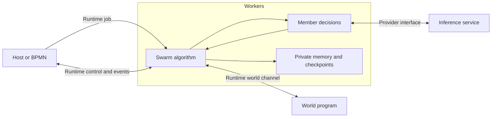

# asys-swarm

Run a population of agents against a world, with bounded decisions, durable
memory and independently checked outcomes. The whole swarm is **one runtime
job in workers**, like goal and senate. Its coordination algorithm lives in
`asys-workers/asys_swarm`; the host launches and observes it.



The world can run as a host process or a separate component. Both use the same
versioned JSON protocol over an asys-runtime channel. The swarm does not import
world code, receive a Python module path, or mount a scenario source directory.
World implementations can use any language that implements the protocol.

## Try Rainkeepers

The [terrarium example](examples/terrarium) is a complete world service, browser
view and two worker environments. Eight inhabitants build gardens and water
infrastructure. After 24 turns every agent leaves and rain stops. Success means
at least six gardens stay healthy through twelve turns without builders.

Build the workers image, then run the deterministic policy without model calls:

```sh
make -C asys-swarm build
mkdir -p ./terrarium-work
asys-swarm/tools/asys-swarm run \
  ./asys-swarm/examples/terrarium/swarm.json \
  ./asys-swarm/examples/terrarium/env/scripted \
  --world ./asys-swarm/examples/terrarium/world \
  --workspace ./terrarium-work --view
```

The launcher builds the selected worker and world images and prints the viewer
address. To use models, select `env/agents` with inference configured. The
teaching world is inspired by [SwarmWorld](../docs/swarm-research.md); it does not
reproduce the MIT simulator or its experimental results.

A host world uses the same configuration and protocol:

```sh
asys-swarm/tools/asys-swarm run \
  ./asys-swarm/examples/terrarium/swarm.json \
  ./asys-swarm/examples/terrarium/env/scripted \
  --world-command '["python3","asys-swarm/examples/terrarium/world/serve.py"]' \
  --workspace ./terrarium-work --view
```

`--world-command` explicitly runs that executable on the host. It receives
`ASYS_RUNTIME_ROOT` and `ASYS_WORLD_CHANNEL`. Use `--world-external` when another
process already manages the world service and attach it to the printed run's
world channel. Component worlds receive that channel as their runtime mount.
The filesystem transport requires both endpoints to access the same channel;
remote machines need an explicit transport or shared filesystem arrangement.

## Ownership

| Part | Responsibility |
| --- | --- |
| Host launcher | Prepare a run, start selected services, submit one swarm job, monitor and clean up owned processes. |
| Runtime | Execute/cancel that job and carry channels, logs and results. |
| Swarm worker | Population identities, private memory, plans, decision scheduling, turn barriers, budgets and checkpoints. |
| Member command | Turn one permitted observation and private memory into bounded actions and replacement memory. |
| World service | Define schemas, per-agent observations, action consequences, objective checks and exported artifacts. |
| Provider | Supply models through the existing inference endpoint. |

The worker stores committed world snapshots for recovery. World operations take
explicit state and return data; they must be deterministic for replay. Agent
private memory is not included in world requests. Participant IDs let the world
track positions, messages and artifact ownership.

Logical population and concurrent decisions are separate limits. Member
commands run as supervised subprocesses of the swarm job; they are not separate
runtime jobs. Their identities, logs and transcripts are retained beneath the
parent job. They remain in the runtime job's process group so cancellation also
stops ongoing model calls and tools.

A turn obtains per-agent observations, runs members that need a plan, waits for
those decisions, then asks the world to apply one action from each plan. This
barrier gives each turn a consistent starting state. It is an algorithm choice
inside workers, not another orchestration service or a reasoning leader.

## Goals and results

`mission` explains what members should pursue. `objective` supplies machine-
readable criteria to the world. Only the world's `evaluate` result can report
success. With `objective: null`, the swarm explores until a budget ends and
reports `achieved: null`. A completed run can therefore have an unmet objective.

Every run records state, decisions, token usage, events and exported artifacts.
Limits cover turns, decisions, concurrency, elapsed time, decision time, action
count, private memory and output tokens. Aggregate token/cost limits are not
currently enforced. See [AUTHORING.md](AUTHORING.md) for the contracts and a
minimal world.

## Observe and control

```sh
asys top
asys status RUN
asys-swarm view RUN --port 8765
asys-swarm pause RUN
asys-swarm resume RUN
asys-swarm cancel RUN
```

Use the same `--root` run-directory setting for these commands. Pause finishes
the current turn before stopping scheduling. Cancellation stops pending member
work and preserves the last committed world. Browser controls use runtime
channels; the view reads saved snapshots and never calls world code.
Cancellation and the wall-clock limit do not wait for another world operation;
their artifact export can be empty, while the committed world snapshot remains.

The viewer remains available after completion. Historical runs from the earlier
controller implementation remain readable. Existing `world.module`
configurations must migrate to a world service; the worker has no module-loading
compatibility path.

## Verification

```sh
make -C asys-swarm test
cd asys-workers && node --test test/swarm-agent.test.mjs
make -C asys-swarm integration-test
```

Tests cover the protocol, worker lifecycle, turn commits, limits, recovery,
per-agent observations and host controls. Integration checks run the scripted
world both on the host and in a component without inference calls.
