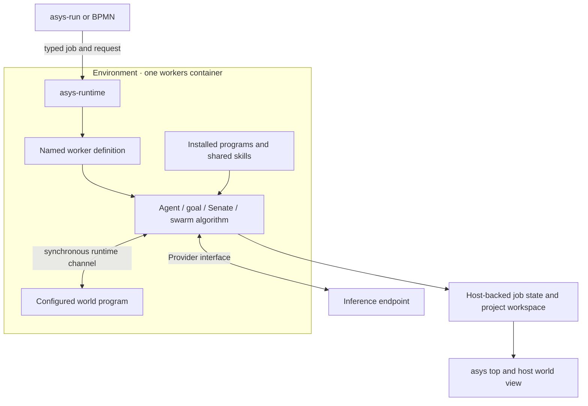

# Workers and environments

An environment supplies installed programs, dependencies, shared skills and one
Dockerfile. Worker definitions describe how to use those resources: a named
agent, a goal loop, a Senate, or a swarm. One environment can contain many of each.
Definitions and their prompt assets are ordinary files that can be reused in
another environment with the required programs and skills.

In 0.2.0 each run uses one workers container built from its selected environment.
The workspace is the actual project directory; an existing worktree works like
any other directory. Durable run state lives under `ROOT/runs`, on the host.



## Author an environment

```sh
asys-workers ./env/development add agent editor
asys-workers ./env/development add goal repair
asys-workers ./env/development add senate review
asys-workers ./env/development add swarm explore
asys-workers ./env/development list
asys-workers ./env/development describe explore
asys-workers ./env/development edit explore

asys-environment ./env/development add-skill ./skills/testing
asys-environment ./env/development dockerfile ./docker/Development.Dockerfile
asys-environment ./env/development edit
```

Adding the first worker creates missing environment files. Existing types and
files are preserved. `add KIND NAME --file FILE` imports a definition.
`edit` uses `$VISUAL` or `$EDITOR`; worker edits are validated before saving.
`asys-environment ENV edit RELATIVE_FILE` edits another environment file.
`dockerfile FILE` replaces the environment's single `Dockerfile` with that file.

`add-skill` copies the complete skill directory, including its resources, into
`ENV/skills/NAME`. Ordinary agents, goal phases and Senate participants discover
these shared skills alongside the selected agent's own skills. They can read
full instructions through their tools. Bounded swarm members include explicit
shared and selected-agent skill instructions in their Provider request; they
do not acquire unrestricted shell tools. Their configured world provides the
actions they can take. Oversized skill input fails explicitly.

```text
env/development/
  Dockerfile                    # installed programs and dependencies
  component.dcomp               # Provider/Human component interfaces
  workers.json                  # ordinary runtime command bindings
  workers/
    editor.json                 # named agent definition
    repair.json                 # named goal definition
    review.json                 # named Senate specification
    explore.json                # named swarm: members, world, limits
  agents/
    editor/prompt.md
    explore-member/prompt.md
  skills/testing/SKILL.md
  programs/explore-evaluate.py   # domain-specific independent check
  worlds/explore/view.mjs        # embedded renderer
```

New swarms contain an editable model member and an evaluator scaffold. The
scaffold refuses initialization until its check is implemented, before any model
call. Define the candidate format and validation in that file, then update the
world settings, initial candidate, measured stopping condition and member prompt.
The supplied [worlds](../asys-workers/worlds/README.md) provide artifact sharing
through a global leaderboard or local visibility on a torus.

## Run any named worker

```sh
asys-run ./env/development simple "Explain this repository"
asys-run ./env/development editor "Improve the parser error messages"
asys-run ./env/development goal "Implement and verify the requested change"
asys-run ./env/development review "Review the design in design.md"
asys-run ./env/development explore "Search for candidates passing the configured check" --view
```

All use the current directory as workspace. Select another with `--workspace
DIRECTORY`; select another state root with `--root DIRECTORY`. `--model MODEL`
overrides an agent or goal definition's model and supplies the fallback for a
Senate or swarm. Otherwise agent definitions can select a
model, or use `asys system-model set simple MODEL`. Explicit Senate participant
and swarm member models retain their configured choices.

`simple` and `goal` are supplied when the environment has no definition or
runtime type with that name. User definitions take precedence. Existing ordinary
program types can also run by name and receive the same request object. Existing
algorithm-specific launchers remain available for their established contracts.

The host prints the run ID and state directory to stderr and the final JSON
result to stdout. `asys top`, `asys status RUN` and `asys logs RUN` inspect it.
`--view --port PORT` starts a local browser view for a swarm; it prints its address
and remains available after completion until interrupted. `asys-swarm view RUN`
opens the retained view later.

## Definitions and workflow jobs

Each `workers/NAME.json` contains `version`, `kind`, optional `description`, and
`config`. For example:

```json
{
  "version": 1,
  "kind": "agent",
  "config": {"agent": "editor", "maxSteps": 24}
}
```

Agent prompts and optional memory live in `agents/editor/`. Goal configuration
accepts `maxAttempts` and `model`. Senate configuration contains its existing
`version`, `princeps`, and `senators` fields. Swarm configuration contains the
population, limits and world executable described in the
[swarm authoring guide](../asys-swarm/AUTHORING.md).

Authoring binds the name into `workers.json` as an ordinary command invoking
`asys-worker --definition ...`. Runtime only executes commands. It does not
interpret agent types or contain an additional swarm controller.

BPMN uses the very same binding, with `xmlns:asys="urn:asys:workflow:1"` on the
definitions element:

```xml
<bpmn:task id="explore" name="Search candidates">
  <bpmn:extensionElements>
    <asys:job type="explore" input="= { request: request }"/>
  </bpmn:extensionElements>
</bpmn:task>
```

The canonical input is `{"request":"...","parameters":{...}}`. Parameters are
optional: agents accept `maxSteps`, goals accept `maxAttempts`; Senate and swarm
configuration is authored in the definition. Parameters cannot replace commands
or world programs. `asys-run --parameters FILE` supplies the optional object.
Each algorithm retains its existing structured result, so workflow expressions
can consume the fields it publishes.

## State and world ownership

The swarm algorithm belongs to workers. It owns member identities, private
memory, scheduling, turn barriers and checkpoints. A named swarm starts its
configured world executable from the environment and supervises it within the
parent job. Both endpoints use private per-job runtime channels. No host module
is injected into workers. Custom worlds can call installed tools, contact network
services if egress is configured, or use other runtime interfaces.

World operations supply per-agent observations, apply actions and check results
synchronously. A global leaderboard can expose all retained artifacts with
`top_k: 0`, or the best N with a positive value. The torus world exposes nearby
artifacts; the dashboard can still show the global results. These are world
policies, not separate swarm engines.

The view lives on the host. A world supplies an ES module exporting
`mount(element, context)` and returning `update(frame)` and `dispose()`. The host
owns controls, polling, recorded frames and playback; the module draws inside its
assigned page element. It uses durable snapshots and events, with no world code
execution on the host. Renderer assets are copied into the run for later viewing.

Definitions are stable configuration. Job state contains conversations, member
memory, checkpoints, measurements and results. Normal execution does not rewrite
the environment or promote proposed lessons into retained agent memory.
